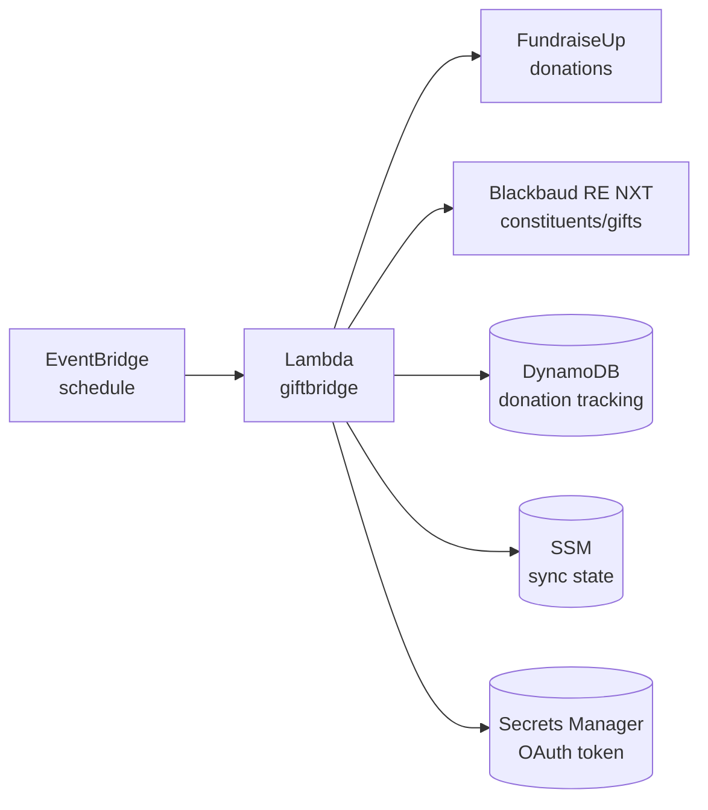

# GiftBridge

Syncs donations from FundraiseUp to Blackbaud Raiser's Edge NXT.

Runs as an AWS Lambda function on a schedule, fetching new donations and creating corresponding gifts and constituents in Raiser's Edge.

## Architecture



## Prerequisites

- AWS CLI configured with appropriate credentials
- FundraiseUp API key
- Blackbaud SKY API application with:
  - Client ID and secret
  - Subscription key
  - OAuth refresh token (from initial authorization flow)

## Deployment

### 1. Configure

```bash
cp infrastructure/.env.example infrastructure/.env
```

Edit `infrastructure/.env` with your credentials and settings. The file includes instructions for finding your Raiser's Edge IDs.

### 2. Deploy

```bash
./deploy.sh
```

That's it! The script will:
- Check you have AWS CLI installed and configured
- Download the latest pre-built binary (or build locally if Go is installed)
- Create the required AWS resources
- Deploy the Lambda function

### Options

```bash
./deploy.sh --stack-name my-giftbridge  # Custom stack name
./deploy.sh --region eu-west-1          # Specific AWS region
./deploy.sh --skip-download             # Build locally instead of downloading
```

## How It Works

1. **Scheduled trigger** - EventBridge invokes the Lambda on a schedule (default: hourly)

2. **Fetch donations** - Retrieves donations from FundraiseUp created since the last sync

3. **For each donation:**
   - Check if already synced (via DynamoDB)
   - Find or create constituent in Raiser's Edge (matched by email)
   - Create gift with configured fund, campaign, appeal, and type
   - Track the donation to gift mapping

4. **Update sync state** - Stores the current timestamp for the next run

## Development

### Run tests

```bash
make test
```

### Run linter

```bash
make lint
```

### Build locally

```bash
GOOS=linux GOARCH=arm64 go build -o bootstrap ./cmd/sync
```

## License

Apache 2.0 - see [LICENSE](LICENSE) for details.
