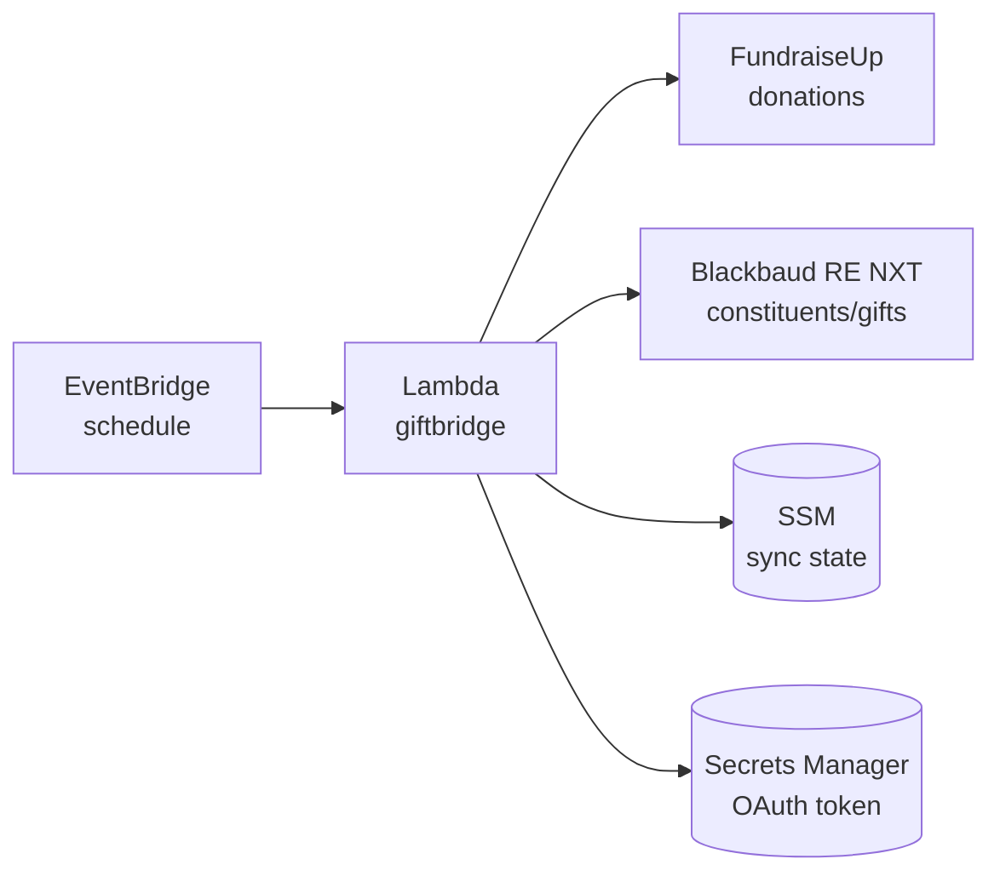

# GiftBridge

A free, open-source tool that automatically syncs donations from [FundraiseUp](https://fundraiseup.com/) to [Blackbaud Raiser's Edge NXT](https://www.blackbaud.com/products/blackbaud-raisers-edge-nxt).

## Why does this exist?

Many charities use **FundraiseUp** for online donations (modern, donor-friendly donation forms) alongside **Raiser's Edge NXT** (Blackbaud's donor management and CRM system).

FundraiseUp offered a free built-in integration that automatically pushed donations into Raiser's Edge NXT. However, [this integration is being discontinued on January 30, 2026](https://community.blackbaud.com/discussion/84271/fundraiseup-integration-gone-1-30-2026) due to changes on Blackbaud's side.

**Without an integration, your options are:**

1. **Manual data entry** — Staff re-type every online donation into Raiser's Edge NXT. Time-consuming and error-prone.
2. **Paid connectors** — Tools like Omatic or ImportOmatic can sync the data, but come with ongoing subscription costs that may be prohibitive for smaller charities.
3. **GiftBridge** — This free, open-source alternative that runs on your own AWS account for roughly $0.10/month.

## Is this for me?

GiftBridge is for you if:

- ✅ You use **FundraiseUp** for online donations
- ✅ You use **Raiser's Edge NXT** (Blackbaud's CRM) for donor management
- ✅ You want donations to sync automatically without manual entry
- ✅ You'd prefer a low-cost solution over expensive third-party connectors

## What happens when someone donates?

1. **Donor gives** via a FundraiseUp donation form on your website
2. **GiftBridge runs** automatically every hour (or on your preferred schedule)
3. **Finds or creates the donor** in Raiser's Edge NXT, matched by email address
4. **Records the gift** with proper fund, campaign, and appeal attribution
5. **Staff see it in Raiser's Edge NXT** — no manual entry required

For recurring donations, GiftBridge links each payment back to the original recurring gift record.

## How it works (technical overview)

GiftBridge runs as an AWS Lambda function on a schedule, fetching new donations and creating corresponding gifts and constituents in Raiser's Edge NXT.

## Architecture



## Prerequisites

### Tools

- **AWS CLI** — installed and configured with credentials that can create Lambda functions, Secrets Manager secrets, and SSM parameters ([install guide](https://docs.aws.amazon.com/cli/latest/userguide/getting-started-install.html))

### Credentials you'll need

| Credential | Where to get it | Who can help |
|------------|-----------------|--------------|
| **FundraiseUp API key** | FundraiseUp Dashboard → Settings → API | Your FundraiseUp admin |
| **Blackbaud client ID & secret** | Blackbaud SKY Developer Portal | Your Raiser's Edge NXT admin (see below) |
| **Blackbaud subscription key** | Blackbaud SKY Developer Portal | Your Raiser's Edge NXT admin |
| **Raiser's Edge NXT fund ID** | Raiser's Edge NXT → Configuration → Funds | Your Raiser's Edge NXT admin |
| **Campaign ID** (optional) | Raiser's Edge NXT → Configuration → Campaigns | Your Raiser's Edge NXT admin |
| **Appeal ID** (optional) | Raiser's Edge NXT → Configuration → Appeals | Your Raiser's Edge NXT admin |

### People who may need to be involved

- **Your Raiser's Edge NXT administrator** — They'll need to:
  - Create a Blackbaud SKY Developer account and application (one-time setup)
  - Grant the application access to your organisation's Raiser's Edge NXT environment
  - Provide the fund/campaign/appeal IDs where donations should be recorded
  - See [Authentication Setup](docs/authentication.md) for detailed steps

- **Your FundraiseUp administrator** — They'll need to:
  - Generate an API key for GiftBridge to read donations

- **Someone comfortable with AWS** — To run the deployment script (or you can follow the step-by-step guide)

## Deployment

### 1. Configure

```bash
cp infrastructure/.env.example infrastructure/.env
```

Edit `infrastructure/.env` with your credentials and settings. The file includes instructions for finding your Raiser's Edge NXT IDs.

### 2. Deploy

```bash
./deploy.sh
```

That's it! The script will:
- Check you have AWS CLI installed and configured
- Download the latest pre-built binary (or build locally if Go is installed)
- Create the required AWS resources
- Deploy the Lambda function

### Options

```bash
./deploy.sh --stack-name my-giftbridge  # Custom stack name
./deploy.sh --region eu-west-1          # Specific AWS region
./deploy.sh --skip-download             # Build locally instead of downloading
```

## Sync Process

1. **Scheduled trigger** — EventBridge invokes the Lambda on a schedule (default: hourly)

2. **Fetch donations** — Retrieves donations from FundraiseUp created since the last sync

3. **For each donation:**
   - Find or create constituent in Raiser's Edge NXT (matched by email)
   - Check if gift already exists (by lookup ID)
   - Create gift with configured fund, campaign, appeal, and type (or skip if exists)

4. **Update sync state** — Stores the current timestamp for the next run

## Local Testing

You can run GiftBridge locally to preview what would be synced - no AWS required for dry-run mode.

### Build for your platform

```bash
make build-local    # Auto-detects your OS
make build-darwin   # macOS (Apple Silicon)
make build-windows  # Windows
```

### Initial setup (one-time)

```bash
# Create local config file
./giftbridge init

# Edit ~/.giftbridge/config.yaml with your credentials

# Authorize with Blackbaud (opens browser for OAuth)
./giftbridge auth
```

### Dry-run mode

Preview what would happen without writing to Blackbaud:

```bash
./giftbridge --dry-run --since=2024-01-01T00:00:00Z
```

This will:
- Read real donations from FundraiseUp
- Check for existing constituents in Raiser's Edge NXT
- Log what *would* be created/updated
- Skip all writes to Raiser's Edge NXT
- No AWS required

### Help

```bash
./giftbridge --help
```

## Development

### Run tests

```bash
make test
```

### Run linter

```bash
make lint
```

### Build targets

```bash
make build            # Lambda deployment (Linux ARM64)
make build-local      # Your current machine
make build-darwin     # macOS Apple Silicon
make build-darwin-amd64  # macOS Intel
make build-windows    # Windows
make build-linux      # Linux x86_64
```

## Estimated AWS Costs

GiftBridge is designed to be extremely cost-effective for small charities.

| Service | Monthly Usage | Cost |
|---------|---------------|------|
| Lambda | ~720 invocations (hourly) × 5s × 128MB | $0.00 (free tier) |
| EventBridge | 720 invocations | $0.00 (free tier) |
| Secrets Manager | 1 secret × 720 calls | ~$0.10 |
| CloudWatch Logs | ~50MB/month | $0.00 (free tier) |
| SSM Parameter Store | 1 parameter | $0.00 (free) |
| **Total** | | **~$0.10/month** |

No database required — Raiser's Edge NXT is used as the source of truth for donation tracking.

## Documentation

- [Authentication Setup](docs/authentication.md) - OAuth flow, credentials, Blackbaud API setup
- [FundraiseUp API](docs/fundraiseup-api.md) - FundraiseUp API setup, rate limits, pagination
- [Field Mapping](docs/field-mapping.md) - How FundraiseUp fields map to Raiser's Edge NXT

## License

Apache 2.0 - see [LICENSE](LICENSE) for details.
