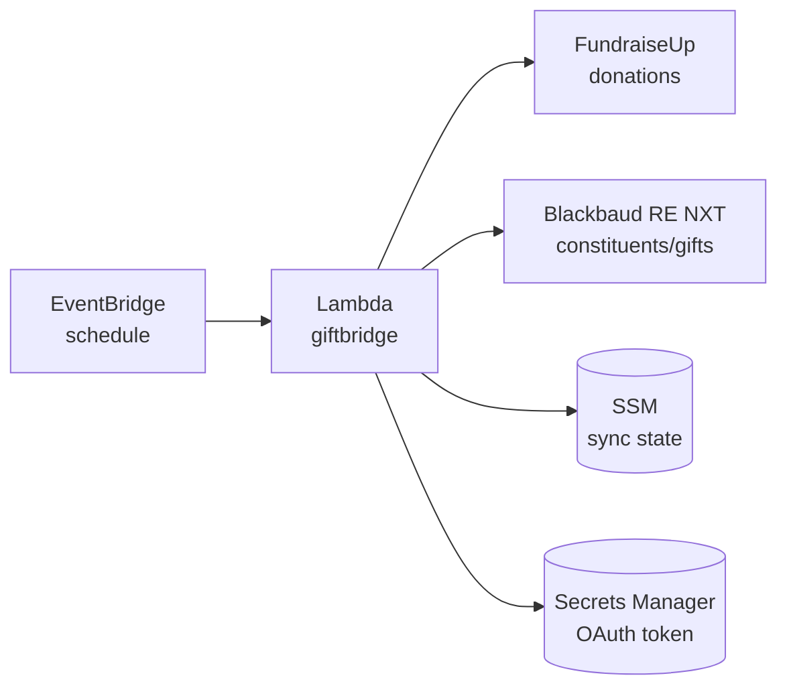

# GiftBridge

Syncs donations from FundraiseUp to Blackbaud Raiser's Edge NXT.

Runs as an AWS Lambda function on a schedule, fetching new donations and creating corresponding gifts and constituents in Raiser's Edge.

## Architecture



## Prerequisites

- AWS CLI configured with appropriate credentials
- FundraiseUp API key
- Blackbaud SKY API credentials (see [Authentication Setup](docs/authentication.md))

## Deployment

### 1. Configure

```bash
cp infrastructure/.env.example infrastructure/.env
```

Edit `infrastructure/.env` with your credentials and settings. The file includes instructions for finding your Raiser's Edge IDs.

### 2. Deploy

```bash
./deploy.sh
```

That's it! The script will:
- Check you have AWS CLI installed and configured
- Download the latest pre-built binary (or build locally if Go is installed)
- Create the required AWS resources
- Deploy the Lambda function

### Options

```bash
./deploy.sh --stack-name my-giftbridge  # Custom stack name
./deploy.sh --region eu-west-1          # Specific AWS region
./deploy.sh --skip-download             # Build locally instead of downloading
```

## How It Works

1. **Scheduled trigger** - EventBridge invokes the Lambda on a schedule (default: hourly)

2. **Fetch donations** - Retrieves donations from FundraiseUp created since the last sync

3. **For each donation:**
   - Find or create constituent in Raiser's Edge (matched by email)
   - Check if gift already exists in Blackbaud (by lookup ID)
   - Create gift with configured fund, campaign, appeal, and type (or skip if exists)

4. **Update sync state** - Stores the current timestamp for the next run

## Local Testing

You can run GiftBridge locally to preview what would be synced - no AWS required for dry-run mode.

### Build for your platform

```bash
make build-local    # Auto-detects your OS
make build-darwin   # macOS (Apple Silicon)
make build-windows  # Windows
```

### Initial setup (one-time)

```bash
# Create local config file
./giftbridge init

# Edit ~/.giftbridge/config.yaml with your credentials

# Authorize with Blackbaud (opens browser for OAuth)
./giftbridge auth
```

### Dry-run mode

Preview what would happen without writing to Blackbaud:

```bash
./giftbridge --dry-run --since=2024-01-01T00:00:00Z
```

This will:
- Read real donations from FundraiseUp
- Check for existing constituents in Blackbaud
- Log what *would* be created/updated
- Skip all writes to Blackbaud
- No AWS required

### Help

```bash
./giftbridge --help
```

## Development

### Run tests

```bash
make test
```

### Run linter

```bash
make lint
```

### Build targets

```bash
make build            # Lambda deployment (Linux ARM64)
make build-local      # Your current machine
make build-darwin     # macOS Apple Silicon
make build-darwin-amd64  # macOS Intel
make build-windows    # Windows
make build-linux      # Linux x86_64
```

## Estimated AWS Costs

GiftBridge is designed to be extremely cost-effective for small charities.

| Service | Monthly Usage | Cost |
|---------|---------------|------|
| Lambda | ~720 invocations (hourly) × 5s × 128MB | $0.00 (free tier) |
| EventBridge | 720 invocations | $0.00 (free tier) |
| Secrets Manager | 1 secret × 720 calls | ~$0.10 |
| CloudWatch Logs | ~50MB/month | $0.00 (free tier) |
| SSM Parameter Store | 1 parameter | $0.00 (free) |
| **Total** | | **~$0.10/month** |

No database required - Blackbaud is used as the source of truth for donation tracking.

## Documentation

- [Authentication Setup](docs/authentication.md) - OAuth flow, credentials, Blackbaud API setup
- [FundraiseUp API](docs/fundraiseup-api.md) - FundraiseUp API setup, rate limits, pagination
- [Field Mapping](docs/field-mapping.md) - How FundraiseUp fields map to Raiser's Edge

## License

Apache 2.0 - see [LICENSE](LICENSE) for details.
